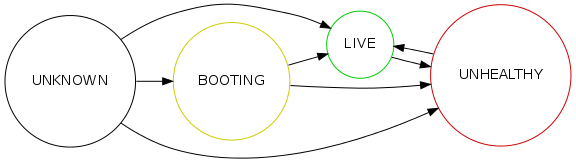

.. elastisys:scale cloud adapter REST API documentation master file, created by
   sphinx-quickstart on Thu Jan 30 14:51:57 2014.
   You can adapt this file completely to your liking, but it should at least
   contain the root `toctree` directive.

elastisys:scale cloud adapter REST API
======================================

All `elastisys:scale <http://elastisys.com/scale>`_ cloud adapters 
are required to publish the REST API described below. 

The REST API should be made available over secure HTTP (HTTPS) and all
API methods are assumed to be synchronous. That is, when they return to the 
caller, their actions have completed (taken effect).

Operations
----------

``GET /pool``
*************

  - Description: Retrieves the current machine pool members.

  - Input: None

  - Output: 

    - On success: HTTP response code 200 with a :ref:`machine_pool_message`

    - On error: HTTP response code 500 with an :ref:`error_response_message`

``POST /pool``
**************

  - Description: Sets the desired number of machines in the machine pool.
  
  - Input: The desired number of machine instances in the pool as a :ref:`resize_request_message`.

  - Output:
  
    - On success: HTTP response code 200 without message content.
  
    - On error: 
      
      - on illegal input: code 400 with an :ref:`error_response_message`
    
      - otherwise: HTTP response code 500 with an :ref:`error_response_message`

Messages
--------

.. _resize_request_message:

Resize request message
**********************

+--------------+-----------------------------------------------------------+
| Description  | A message used to request that the machine pool be        |
|              | resized to a desired number of machine instances.         |
+--------------+-----------------------------------------------------------+
| Content type |  ``application/json``                                     |
+--------------+-----------------------------------------------------------+
| Schema       | ``{ "desiredCapacity": <number> }``                       |
+--------------+-----------------------------------------------------------+

Sample document: ::

     { "desiredCapacity": 3 }

States that we want three machine instances in the pool.

.. _error_response_message:

Error response message
**********************

+--------------+----------------------------------------------------+
| Description  | Contains further details (in addition to the HTTP  |
|              | response code) on server-side errors.              |
+--------------+----------------------------------------------------+
| Content type |  ``application/json``                              |
+--------------+----------------------------------------------------+
| Schema       | ``{ "message": <string>, "detail": <string> }``    |
+--------------+----------------------------------------------------+

The ``message`` is a human-readable error message intended for presentation, 
whereas the ``detail`` attribute holds error details (such as a stack trace).

This is a sample error message: ::

  {
    "message": "failure to process pool get request",
    "detail": "... long stacktrace ..."
  }

.. _machine_pool_message:

Machine pool message
********************

+--------------+----------------------------------------------------+
| Description  | Describes the current status of the monitored      |
|              | machine pool.                                      |
+--------------+----------------------------------------------------+
| Content type |  ``application/json``                              |
+--------------+----------------------------------------------------+

The machine pool schema has the following structure: ::

   {
     "timestamp": <iso-8601 datetime>,
     "machines": [ <machine> ... ]
   }

Here, every ``<machine>`` is also a json document with the following structure: ::

  {
    "id": <string>,
    "state": <state>,
    "liveness": <liveness state>,
    "launchtime": <iso-8601 datetime>,
    "publicIps": [<ip-address>, ...],
    "privateIps": [<ip-address>, ...],
    "metadata": <jsonobject>
  } 

The attributes are to be interpreted as follows:
  
  * ``id``: The identifier of the machine.
  * ``state``: The execution state of the machine. See the 
    :ref:`machine state table <machine_state_table>` below for the range of possible values.
  * ``liveness``: Additional state information about the operational status of the machine 
    for machines in an *active machine state* (``PENDING`` or ``RUNNING``). 
    This is an optional field that may be included for cloud adapters that monitor machine
    liveness on pool members.
    See the :ref:`liveness state table <liveness_state_table>` below for the range of 
    possible values.
  * ``launchtime``: The launch time of the machine if it has been launched. If the machine
    is in a state where it hasn't been launched yet (``REQUESTED`` state) this attribute
    may be left out or set to ``null``.
  * ``publicIps``: The list of public IP addresses associated with this machine. Depending
    on the state of the machine, this list may be empty.
  * ``privateIps``: The list of private IP addresses associated with this machine. Depending
    on the state of the machine, this list may be empty.
  * ``metadata``: a JSON object of arbitrary depth carrying cloud-specific meta data.

The ``state`` attribute value is a string that may take on any of the following values:

.. _machine_state_table:

+-----------------+---------------------------------------------------------------------+
| State           | Description                                                         |
+=================+=====================================================================+
| ``REQUESTED``   | The machine has been requested from the underlying infrastructure   |
|                 | and the request is pending fulfillment.                             |
+-----------------+---------------------------------------------------------------------+
| ``REJECTED``    | The machine request was rejected by the underlying infrastructure.  |
+-----------------+---------------------------------------------------------------------+
| ``PENDING``     | The machine is in the process of being launched.                    |
+-----------------+---------------------------------------------------------------------+
| ``RUNNING``     | The machine is launched. However, the boot process may not yet have |
|                 | completed and the machine may not be operational (the machine's     |
|                 | :ref:`liveness <liveness_state_table>` attribute may provide more   |
|                 | detailed state information).                                        |
+-----------------+---------------------------------------------------------------------+
| ``TERMINATING`` | The machine is in the process of being stopped/shut down.           |
+-----------------+---------------------------------------------------------------------+
| ``TERMINATED``  | The machine has been stopped/shut down.                             |
+-----------------+---------------------------------------------------------------------+

The diagram below illustrates the state transitions that describe the lifecycle of a machine.

.. image:: images/machinestates.png
  :width: 700px

At any time, the effective size of the machine pool should be interpreted as the
number of allocated machines in a non-terminal state. That is, machines in one of 
the states ``REQUESTED``, ``PENDING``, or ``RUNNING``.

The ``PENDING`` and ``RUNNING`` states are said to be the *active machine 
states*. Machines in an active state are executing. However, just because a machine 
is active (``PENDING``, ``RUNNING``) doesn't necessarily mean that it is doing 
useful work. For example, it may have failed to properly boot. 
For active machines, a cloud adapter *may* (optionally) choose to include a *liveness state*, 
which basically describes the operational state of the machine. The liveness state can
be useful, for example, for work dispatchers or load balancers to know that a given machine
is ready to accept work.

The ``liveness`` attribute value is a string that may take on any of the following values:

.. _liveness_state_table:

+-----------------+---------------------------------------------------------------------+
| Liveness state  | Description                                                         |
+=================+=====================================================================+
| ``BOOTING``     | The machine is being bootstrapped and may not (yet) be operational. |
+-----------------+---------------------------------------------------------------------+
| ``LIVE``        | The machine is operational (liveness tests pass).                   |
+-----------------+---------------------------------------------------------------------+
| ``UNHEALTHY``   | The machine may not be operational (liveness tests fail).           |
+-----------------+---------------------------------------------------------------------+
| ``UNKNOWN``     | The liveness state of the machine is currently unknown              |
|                 | (it may, for example, not have been possible to determine yet).     |
+-----------------+---------------------------------------------------------------------+

One approach to monitor the livess state of machine pool members it to periodically 
run *liveness tests* on the machine pool members. Such a test could for example be to run 
an SSH command on each machine. A cloud adapter that doesn't monitor liveness for its machine 
pool should always set the liveness state to ``UNKNOWN`` for all machines.

The diagram below illustrates the state transitions for a machine's liveness.

Below is a sample machine pool document: ::

  {
    "timestamp": "2013-11-07T13:50:00.000Z",
    "machines": [
      {
        "id": "i-123456",
        "state": "RUNNING",
        "liveness": "LIVE",
        "launchtime": "2013-11-07T14:50:00.000Z",
        "publicIps": ["54.211.230.169"],
        "privateIps": ["10.122.122.69"],
        "metadata": {
          "scaling-group": "mygroup"         
        }
      },
      {
        "id": "i-123457",
        "state": "PENDING",
        "liveness": "BOOTING",
        "launchtime": "2013-11-07T13:49:50.000Z",        
        "publicIps": [],
        "privateIps": [],
        "metadata": {
          "scaling-group": "mygroup",
        }
      }
    ]
  }

