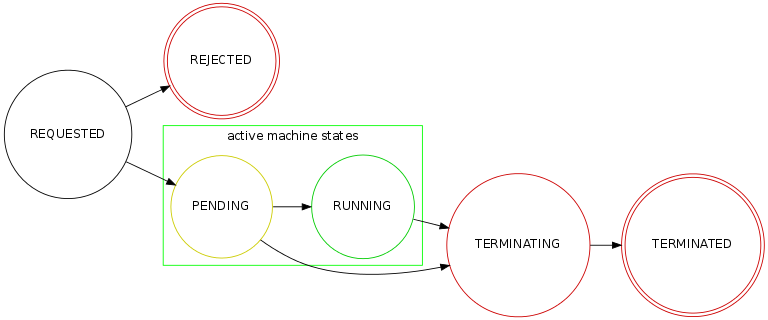

.. elastisys cloud pool REST API documentation master file, created by
   sphinx-quickstart on Thu Jan 30 14:51:57 2014.
   You can adapt this file completely to your liking, but it should at least
   contain the root `toctree` directive.

elastisys cloud pool REST API
=============================

All `elastisys <http://elastisys.com/>`_ cloud pool endpoints 
are required to publish the REST API described below. 

The primary purpose of the cloud pool API is to serve as a bridge 
between an autoscaler and a certain cloud provider, allowing the autoscaler 
to operate in a cloud-neutral manner. As such, it focuses on primitives
for managing a dynamic collection of machines.

All API methods assume a ``Content-Type`` of ``application/json``.

The REST API should be made available over secure HTTP (HTTPS).

Terminology and machine state model
-----------------------------------
Cloud providers differ in how they refer to the computational
resources they provide. Some common terms are `instances`, `servers` and 
`VMs`/`virtual machines`.

The cloud pool API strives to be as cloud-neutral as possible and 
simply refers to the computational resources being managed as **machines**. 
The logical group of machines that a cloud pool manages is referred to
as its **machine pool**.

.. _machine_state:

machine state
*************
A cloud pool needs to be able to report the execution state of its machine 
pool members in a cloud-neutral manner (see :ref:`get_machine_pool`). 
Since cloud providers differ quite a lot in the state models they use, the 
cloud pool needs to map the cloud-native state of the machine to one of 
the **machine states** supported by the cloud pool API. These states are 
described in the :ref:`machine state table <machine_state_table>` below.

.. _machine_state_table:

+-----------------+---------------------------------------------------------------------+
| Machine state   | Description                                                         |
+=================+=====================================================================+
| ``REQUESTED``   | The machine has been requested from the underlying infrastructure   |
|                 | and the request is pending fulfillment.                             |
+-----------------+---------------------------------------------------------------------+
| ``REJECTED``    | The machine request was rejected by the underlying infrastructure.  |
+-----------------+---------------------------------------------------------------------+
| ``PENDING``     | The machine is in the process of being launched.                    |
+-----------------+---------------------------------------------------------------------+
| ``RUNNING``     | The machine is launched. However, the boot process may not yet have |
|                 | completed and the machine may not be operational (the machine's     |
|                 | :ref:`service state <service_state_table>` may provide more         |
|                 | detailed state information).                                        |
+-----------------+---------------------------------------------------------------------+
| ``TERMINATING`` | The machine is in the process of being stopped/shut down.           |
+-----------------+---------------------------------------------------------------------+
| ``TERMINATED``  | The machine has been stopped/shut down.                             |
+-----------------+---------------------------------------------------------------------+

The diagram below illustrates the state transitions that describe the lifecycle of 
a machine.

The ``PENDING`` and ``RUNNING`` states are said to be the *started machine 
states*. Machines in a started state are executing. However, just because a machine 
is executing doesn't necessarily mean that it is doing useful work. For example, it may
have failed to properly boot, it may have crashed or encountered a fatal bug.

So the machine state is the execution state of the machine, as reported by the cloud
API, which really only tells us if a particular pool member is started or not.
To be able to reason about the *health* of a pool member, each machine's metadata 
carries two additional state fields -- the :ref:`membership_status` and the :ref:`service_state`.
These states are intended to be set by external means, such as by a human operator
or an external health monitoring service. A cloud pool is required to be ready to receive 
state updates these fields (see :ref:`set_membership_status` and :ref:`set_service_state`)
for the machines its pool and to include those states on subsequent queries about 
the pool members (:ref:`get_machine_pool`).

.. _membership_status:

membership status
*****************
The **membership status** is used to indicate to the cloud pool that a certain
machine needs to be given special treatment. The membership status can, for 
example, be set to protect a machine from being terminated (by setting its 
evictability) or to mark a machine as being in need of replacement (by setting 
its activity flag). This allows us, for example, to isolate a failed machine for 
further inspection and to provision a replacement to sustain sufficient capacity.
It also allows us to have "blessed"/"seed" pool members that may not be 
terminated. See the :ref:`set_membership_status` method for more deatils.

The ``active`` and ``evictable`` fields of the membership status can be combined
according to the table below to produce four main membership states:

+-------------------+------------+------------------+ 
|                   | **active** | **not active**   |
+===================+============+==================+ 
| **evictable**     | default    | disposable       | 
+-------------------+------------+------------------+ 
| **not evictable** | blessed    | awaiting service | 
+-------------------+------------+------------------+ 

  - ``default``: a machine that is both an active and evictable group member.

  - ``blessed``: a machine that is a permanent pool member that cannot be 
    evicted. This can, for example, be used to include `reserved machine 
    instances <http://aws.amazon.com/ec2/purchasing-options/reserved-instances/>`_
    in the pool.

  - ``awaiting service``: a machine that is in need of service. The machine
    is to be replaced and should be kept alive for troubleshooting.

  - ``disposable``: a machine that is non-functioning and should be replaced 
    and terminated.

At any time, the *active size* of the cloud pool should be interpreted as the
number of allocated machines that have not been marked with an inactive membership 
status. That is, all machines in one of the machine states ``REQUESTED``, ``PENDING``, 
or ``RUNNING`` and *not* having a membership status with ``active`` set to ``false``.

.. _service_state:

service state
*************
There are cases where we need to be able to reason about the operational state of
the service running on the machine. For example, we may not want to register a running
machine to a load balancer until it is fully initialized and ready to accept requests, and
we may want to unregister unhealthy machines. To this end, a cloud pool may include 
a **service state** for a machine. Whereas the *machine state*
should be viewed  as the execution state of the *machine*, 
the *service state* should be viewed as the operational health of the 
*service running on the machine*. Service states have no semantic implications to the
cloud pool. They should be regarded as informational "marker states" that may be used
by third party services (such as a load balancer).

The range of permissible service states are as follows:

.. _service_state_table:

+---------------------+---------------------------------------------------------------------+
| Service state       | Description                                                         |
+=====================+=====================================================================+
| ``BOOTING``         | The service is being bootstrapped and may not (yet) be operational. |
+---------------------+---------------------------------------------------------------------+
| ``IN_SERVICE``      | The service is operational and ready to accept work (health checks  |
|                     | pass).                                                              |
+---------------------+---------------------------------------------------------------------+
| ``UNHEALTHY``       | The service is not functioning properly (health checks fail).       |
+---------------------+---------------------------------------------------------------------+
| ``OUT_OF_SERVICE``  | The service is unhealthy and has been taken out of service for      |
|                     | troubleshooting and/or repair.                                      |
+---------------------+---------------------------------------------------------------------+
| ``UNKNOWN``         | The service state of the machine cannot be (or has not yet been)    |
|                     | determined.                                                         |
+---------------------+---------------------------------------------------------------------+

See the :ref:`set_service_state` method for more deatils.

Operations
----------

.. _get_metadata:

Get metadata
************

 - **Method**: ``GET /pool/metadata``
 - **Description**: Retrieves metadata about the cloud adapter and the cloud
   infrastructure.

   The metadata is a simple JSON document that shows what API version(s) this
   cloud pool supports, whether the cloud infrastructure supports returning
   a dependable value for when a machine was requested, and a unique identifier
   for the cloud infrastructure.

 - **Input**: None
 - **Output**: 
      - On success: HTTP response code 200 with a :ref:`metadata_message`
      - On error: HTTP response code 500 with an :ref:`error_response_message`

.. _get_machine_pool:

Get machine pool
****************
  
  - **Method**: ``GET /pool``
  - **Description**: Retrieves the current machine pool members.

    Note that the returned machines may be in any :ref:`machine_state`
    (``REQUESTED``, ``RUNNING``, ``TERMINATED``, etc).

    The :ref:`membership_status` of a started machine determines if
    it is to be considered an active member of the pool.The *active size* 
    of the machine pool should be interpreted as the number of allocated 
    machines (in any of the non-terminal machine states ``REQUESTED``,
    ``PENDING`` or ``RUNNING`` that have not been marked with an inactive
    :ref:`membership_status`.

    The :ref:`service_state` should be set to ``UNKNOWN`` for all machine instances 
    for which no service state has been reported (see :ref:`set_service_state`).

    Similarly, the :ref:`membership_status` should be set to the default 
    (active, evictable) status for all machine instances for which no membership 
    status has been reported (see :ref:`set_membership_status`).

  - **Input**: None
  - **Output**: 
      - On success: HTTP response code 200 with a :ref:`machine_pool_message`
      - On error: HTTP response code 500 with an :ref:`error_response_message`

.. _get_pool_size:

Get pool size
*************

  - **Method**: ``GET /pool/size``
  - **Description**: Returns the current size of the machine pool -- both in terms of
    the desired size and the actual size (as these may differ at any time).
  - **Input**: None
  - **Output**: 
      - On success: HTTP response code 200 with a :ref:`pool_size_message`
      - On error: HTTP response code 500 with an :ref:`error_response_message`

.. _set_desired_size:

Set desired size
****************

  - **Method**: ``POST /pool/size``
  - **Description**: Sets the desired number of machines in the machine pool.
    This method is asynchronous and returns immediately after updating the
    desired size. There may be a delay before the changes take effect and
    are reflected in the machine pool.

    Note: the cloud pool should take measures to ensure that requested 
    machines are recognized as pool members. The specific mechanism to mark 
    group members, which may depend on the features offered by the particular
    cloud API, is left to the implementation but could, for example, make use
    of tags.
  - **Input**: The desired number of machine instances in the pool as a :ref:`set_desired_size_message`.
  - **Output**:
      - On success: HTTP response code 200 without message content.
      - On error:    
          - on illegal input: code 400 with an :ref:`error_response_message`
          - otherwise: HTTP response code 500 with an :ref:`error_response_message`

.. _terminate_machine:

Terminate machine
*****************

  - **Method**: ``POST /pool/<machineId>/terminate``
  - **Description**: Terminates a particular machine pool member with id ``<machineId>``.
    The caller can control if a replacement machine is to be provisioned via the
    ``decrementDesiredSize``
    parameter. 
  - **Input**: A :ref:`terminate_machine_message`.
  - **Output**:
      - On success: HTTP response code 200 without message content.
      - On error:    
          - on illegal input: code 400 with an :ref:`error_response_message`
          - if the machine is not a pool member: code 404 with an :ref:`error_response_message`
          - otherwise: HTTP response code 500 with an :ref:`error_response_message`

.. _set_membership_status:

Set membership status
*********************

  - **Method**: ``POST /pool/<machineId>/membershipStatus``
  - **Description**:  Sets the :ref:`membership_status` of a given pool member.

    The membership status for a machine can be set to protect the machine
    from being terminated (by setting its evictability status) and/or to mark
    a machine as being in need of replacement by flagging it as an inactive
    pool member.

    The specific mechanism to mark group members, which may depend on the 
    features offered by the particular cloud API, is left to the 
    implementation but could, for example, make use of tags.
  - **Input**: A :ref:`set_membership_status_message`.
  - **Output**:
      - On success: HTTP response code 200 without message content.
      - On error:    
          - on illegal input: code 400 with an :ref:`error_response_message`
          - if the machine is not a pool member: code 404 with an :ref:`error_response_message`
          - otherwise: HTTP response code 500 with an :ref:`error_response_message`

.. _set_service_state:

Set service state
*****************

  - **Method**: ``POST /pool/<machineId>/serviceState``
  - **Description**: Sets the :ref:`service_state` of a given machine pool member. 
 
    Setting the service state does not have any functional implications on the pool
    member, but should be seen as way to supply operational information about
    the service running on the machine to third-party services (such as load
    balancers).

    The specific mechanism to mark group 
    members, which may depend on the features offered by the particular cloud 
    API, is left to the implementation but could, for example, make use of tags.
  - **Input**: A :ref:`set_service_state_message`.
  - **Output**:
      - On success: HTTP response code 200 without message content.
      - On error:    
          - on illegal input: code 400 with an :ref:`error_response_message`
          - if the machine is not a pool member: code 404 with an :ref:`error_response_message`
          - otherwise: HTTP response code 500 with an :ref:`error_response_message`

.. _detach_machine:

Detach machine
**************

  - **Method**: ``POST /pool/<machineId>/detach``
  - **Description**: Removes a particular machine pool member with id ``<machineId>``
    from the pool without terminating it. 
    The machine keeps running but is no longer considered a pool member and,
    therefore, needs to be managed independently. The caller can control if 
    a replacement machine is to be provisioned via the ``decrementDesiredSize``
    parameter. 
  - **Input**: A :ref:`detach_machine_message`.
  - **Output**:
      - On success: HTTP response code 200 without message content.
      - On error:    
          - on illegal input: code 400 with an :ref:`error_response_message`
          - if the machine is not a pool member: code 404 with an :ref:`error_response_message`
          - otherwise: HTTP response code 500 with an :ref:`error_response_message`

.. _attach_machine:

Attach machine
**************

  - **Method**: ``POST /pool/<machineId>/attach``
  - **Description**: Attaches an already running machine with a given 
    ``<machineId>`` to the machine pool, growing the pool with a new member.
    This operation implies that the desired size of the group is incremented by one.
  - **Input**: None
  - **Output**:
      - On success: HTTP response code 200 without message content.
      - On error:    
          - on illegal input: code 400 with an :ref:`error_response_message`
          - if the machine does not exist: code 404 with an :ref:`error_response_message`
          - otherwise: HTTP response code 500 with an :ref:`error_response_message`

Messages
--------

.. _metadata_message:

Metadata message
****************

+--------------+-----------------------------------------------------------+
| Description  | A message used to disclose metadata about the cloud pool  |
|              | and the cloud infrastructure it manages.                  |
+--------------+-----------------------------------------------------------+

The metadata message has the following schema: ::

    { 
      "supportedApiVersions": [<version strings>],
      "cloudSupportsRequesttime": <boolean>,
      "poolIdentifier": <string>
    }
    
The version strings all follow this regular expression: ::

    \d+(.\d+)?

Sample document: ::

    { 
      "supportedApiVersions": ["1", "2.0", "3.14"],
      "poolIdentifier": "AWS_EC2",
      "cloudSupportsRequesttime": false
    }

.. _set_desired_size_message:

Set desired size message
************************

+--------------+-----------------------------------------------------------+
| Description  | A message used to request that the machine pool be        |
|              | resized to a desired number of machine instances.         |
+--------------+-----------------------------------------------------------+
| Schema       | ``{ "desiredSize": <number> }``                           |
+--------------+-----------------------------------------------------------+

Sample document: ::

     { "desiredSize": 3 }

States that we want three machine instances in the pool.

.. _error_response_message:

Error response message
**********************

+--------------+----------------------------------------------------+
| Description  | Contains further details (in addition to the HTTP  |
|              | response code) on server-side errors.              |
+--------------+----------------------------------------------------+
| Schema       | ``{ "message": <string>, "detail": <string> }``    |
+--------------+----------------------------------------------------+

The ``message`` is a human-readable error message intended for presentation, 
whereas the ``detail`` attribute holds error details (such as a stack trace).

This is a sample error message: ::

  {
    "message": "failure to process pool get request",
    "detail": "... long stacktrace ..."
  }

.. _machine_pool_message:

Machine pool message
********************

+--------------+----------------------------------------------------+
| Description  | Describes the current status of the monitored      |
|              | machine pool.                                      |
+--------------+----------------------------------------------------+

The machine pool schema has the following structure: ::

   {
     "timestamp": <iso-8601 datetime>,
     "machines": [ <machine> ... ]
   }

Here, every ``<machine>`` is also a json document with the following structure: ::

  {
    "id": <string>,
    "machineState": <machine state>,
    "membershipStatus": {"active": bool, "evictable": bool},
    "serviceState": <service state>,
    "launchtime": <iso-8601 datetime>,
    "publicIps": [<ip-address>, ...],
    "privateIps": [<ip-address>, ...],
    "metadata": <jsonobject>
  } 

The attributes are to be interpreted as follows:
  
  * ``id``: The identifier of the machine.
  * ``machineState``: The execution state of the machine. See the section on :ref:`machine_state`.
  * ``membershipStatus``: The :ref:`membership_status` of the machine.
  * ``serviceState``: The operational state of the service running on the machine.
    See the section on :ref:`service_state`.
  * ``launchtime``: The launch time of the machine if it has been launched. If the machine
    is in a state where it hasn't been launched yet (``REQUESTED`` state) this attribute
    may be left out or set to ``null``.
  * ``publicIps``: The list of public IP addresses associated with this machine. Depending
    on the state of the machine, this list may be empty.
  * ``privateIps``: The list of private IP addresses associated with this machine. Depending
    on the state of the machine, this list may be empty.
  * ``metadata``: Additional cloud provider-specific meta data about the machine.
    This field is optional (may be ``null``).

Below is a sample machine pool document: ::

  {
    "timestamp": "2013-11-07T13:50:00.000Z",
    "machines": [
      {
        "id": "i-123456",
        "machineState": "RUNNING",
        "membershipStatus": {"active": true, "evictable": true},
        "serviceState": "IN_SERVICE",
        "launchtime": "2013-11-07T14:50:00.000Z",
        "publicIps": ["54.211.230.169"],
        "privateIps": ["10.122.122.69"],
        "metadata": {
          "scaling-group": "mygroup"         
        }
      },
      {
        "id": "i-123457",
        "machineState": "PENDING",
        "membershipStatus": {"active": true, "evictable": true},
        "serviceState": "BOOTING",
        "launchtime": "2013-11-07T13:49:50.000Z",        
        "publicIps": [],
        "privateIps": [],
        "metadata": {
          "scaling-group": "mygroup",
        }
      }
    ]
  }

.. _pool_size_message:

Pool size message
*****************

+--------------+---------------------------------------------------------------------------------------+
| Description  | Carries information about the pool size, both                                         |
|              | desired and actual size.                                                              |
+--------------+---------------------------------------------------------------------------------------+
| Schema       | ``{ "desiredSize": <number>, "allocated": <number>, "active": <number> }``            |
+--------------+---------------------------------------------------------------------------------------+

The attributes are to be interpreted as follows:
  
  * ``desiredSize``: The last desired size set for the machine pool (see :ref:`set_desired_size`).
  * ``allocated``: The number of allocated machines in the pool (in one of 
    machine states ``REQUESTED``, ``PENDING``, ``RUNNING``)
  * ``active``: The number of machines in the pool with an ``active`` :ref:`membership_status`.

Example: ::

   { "desiredSize": 3, "allocated": 4, "active": 3 }

.. _terminate_machine_message:

Terminate machine message
*************************

+--------------+-----------------------------------------------------------------+
| Description  | Specifies if the desired size of the machine pool               |
|              | should be decremented after terminating the machine             |
|              | (that is, it controls if a replacement machine should           |
|              | be launched)                                                    |
+--------------+-----------------------------------------------------------------+
| Schema       | ``{ "decrementDesiredSize": <boolean> }``                       |
+--------------+-----------------------------------------------------------------+

The attributes are to be interpreted as follows:
  
  * ``decrementDesiredSize``: ``true`` if the desired pool size should 
    be decremented, ``false`` otherwise.

Example where a replacement machine is desired: ::

   { "decrementDesiredSize": false }

.. _detach_machine_message:

Detach machine message
**********************

+--------------+-----------------------------------------------------------------+
| Description  | Specifies if the desired size of the machine pool               |
|              | should be decremented after detaching the machine               |
|              | (that is, it controls if a replacement machine should           |
|              | be launched)                                                    |
+--------------+-----------------------------------------------------------------+
| Schema       | ``{ "decrementDesiredSize": <boolean> }``                       |
+--------------+-----------------------------------------------------------------+

The attributes are to be interpreted as follows:
  
  * ``decrementDesiredSize``: ``true`` if the desired pool size should 
    be decremented, ``false`` otherwise.

Example where a replacement machine is desired: ::

   { "decrementDesiredSize": false }

.. _set_membership_status_message:

Set membership status message
*****************************

+--------------+-----------------------------------------------------------------+
| Description  | Specifies the membership status for a machine.                  |
+--------------+-----------------------------------------------------------------+
| Schema       | ``{ "membershipStatus": {"active": bool, "evictable": bool} }`` |
+--------------+-----------------------------------------------------------------+

The attributes are to be interpreted as follows:
  
  * ``active``: Indicates if this is an active (working) pool member. A ``true``
    value indicates that this machine is a functioning pool member. A
    ``false`` value indicates that a replacement machine needs to be launched 
    for this pool member.
  * ``evictable``: Indicates if this machine is a blessed member of the
    machine pool. That is, if this field is ``true``, the cloud pool may not 
    select this machine for termination when pool needs to be scaled in.

Example of a membership status for a broken machine that needs a replacement
(``active`` == ``false``), but is to be kept around in the pool for troubleshooting
(``evictable`` == ``false``): ::

   { "membershipStatus": {"active": false, "evictable": false} }

.. _set_service_state_message:

Set service state message
*************************

+--------------+-----------------------------------------------------------------+
| Description  | Specifies the service state to set for the machine.             |
+--------------+-----------------------------------------------------------------+
| Schema       | ``{ "serviceState": "<service state>" }``                       |
+--------------+-----------------------------------------------------------------+

The attributes are to be interpreted as follows:
  
  * ``serviceState``: The :ref:`service state <service_state_table>` to set.

Example where a replacement machine is desired: ::

   { "serviceState": "IN_SERVICE" }
